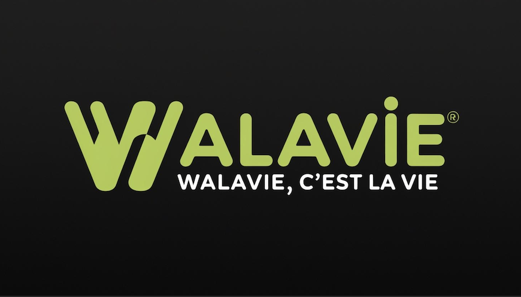

  <a href="https://www.waveterm.dev">
	<picture>
		<source srcset="./assets/walavie.png">
		
	</picture>
  </a>
   

# Walavie Terminal

Walavie is an open-source terminal that combines traditional terminal features with graphical capabilities like file previews, web browsing, and AI assistance. It runs on MacOS, Linux, and Windows.

Modern development involves constantly switching between terminals and browsers - checking documentation, previewing files, monitoring systems, and using AI tools. Walavie brings these graphical tools directly into the terminal, letting you control them from the command line. This means you can stay in your terminal workflow while still having access to the visual interfaces you need.

## Key Features

- Flexible drag & drop interface to organize terminal blocks, editors, web browsers, and AI assistants
- Built-in editor for seamlessly editing remote files with syntax highlighting and modern editor features
- Rich file preview system for remote files (markdown, images, video, PDFs, CSVs, directories)
- Integrated AI chat with support for multiple models (OpenAI, Claude, Azure, Perplexity, Ollama)
- Command Blocks for isolating and monitoring individual commands with auto-close options
- One-click remote connections with full terminal and file system access
- Rich customization including tab themes, terminal styles, and background images
- Powerful `wsh` command system for managing your workspace from the CLI and sharing data between terminal sessions
- Sui & Walrus as the backend service to ensure secure, highly available, decentralized data storage 
- MCP (Model Context Protocol) style file operations (copying files/directories between local filesystem and Walrus storage, etc)

## Installation

Walavie Terminal works on macOS, Linux, and Windows.

Platform-specific installation instructions can be found [here](https://docs.waveterm.dev/gettingstarted).

### Minimum requirements

Walavie Terminal runs on the following platforms:

- macOS 11 or later (arm64, x64)
- Windows 10 1809 or later (x64)
- Linux based on glibc-2.28 or later (Debian 10, RHEL 8, Ubuntu 20.04, etc.) (arm64, x64)

The WSH helper runs on the following platforms:

- macOS 11 or later (arm64, x64)
- Windows 10 or later (arm64, x64)
- Linux Kernel 2.6.32 or later (x64), Linux Kernel 3.1 or later (arm64)

## Links

- Homepage &mdash; https://www.waveterm.dev
- Documentation &mdash; https://docs.waveterm.dev

## Building from Source

See [Building Walavie Terminal](BUILD.md).

## License

Walavie Terminal is licensed under the Apache-2.0 License.

## Acknowledge

Forked from and thanks to 
- [Wave Terminal](https://github.com/wavetermdev/waveterm)

